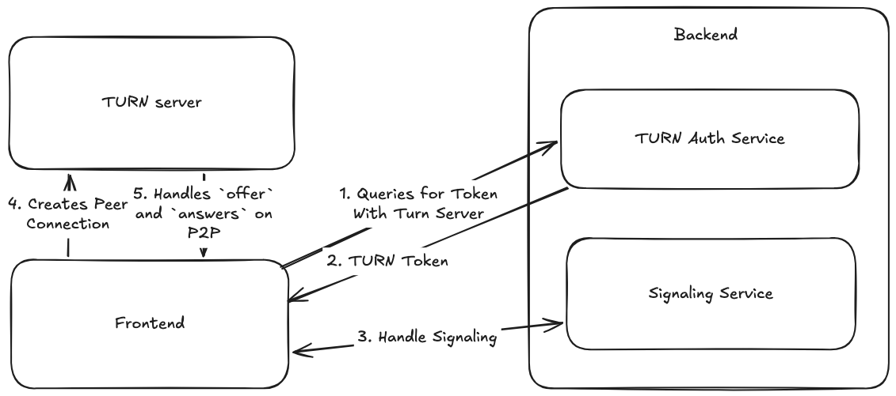

# SKB.VideoMultiplexer
This project is a video multiplexer that allows you to combine multiple video streams into a single output stream.
It is designed to be efficient and easy to use, making it ideal for applications such as live streaming,
video conferencing, and more.

## Requirements

## Getting Started

## Contribution
